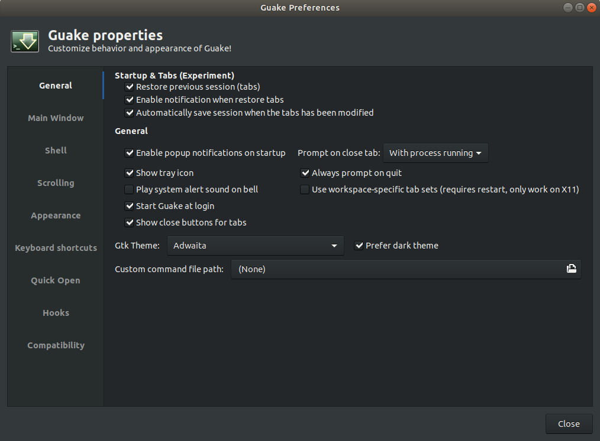
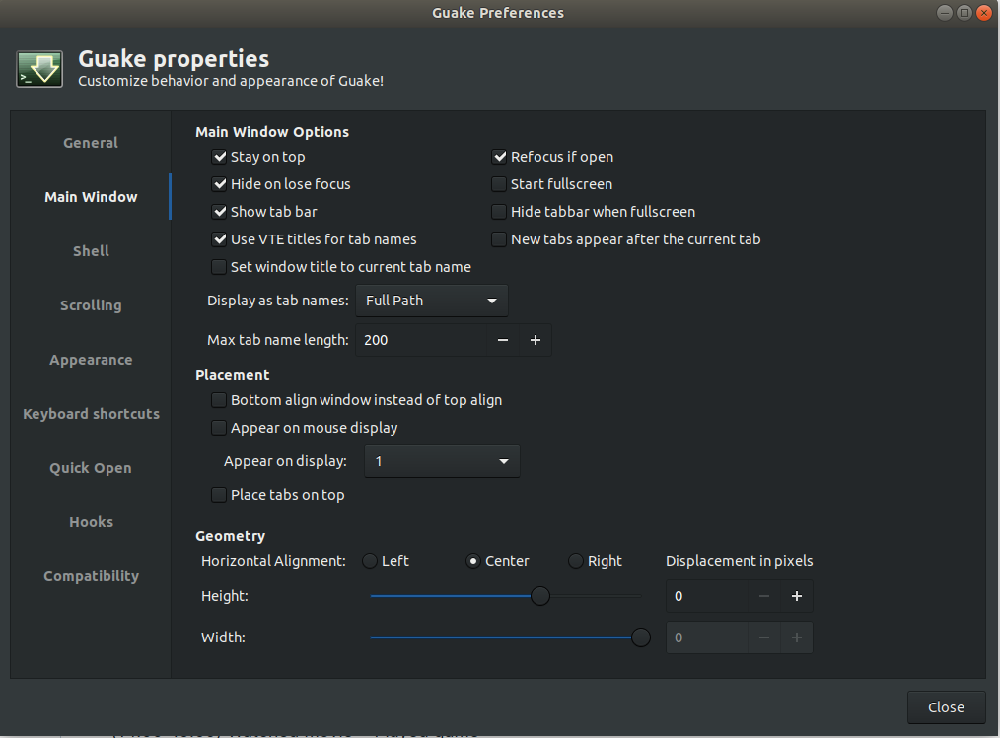
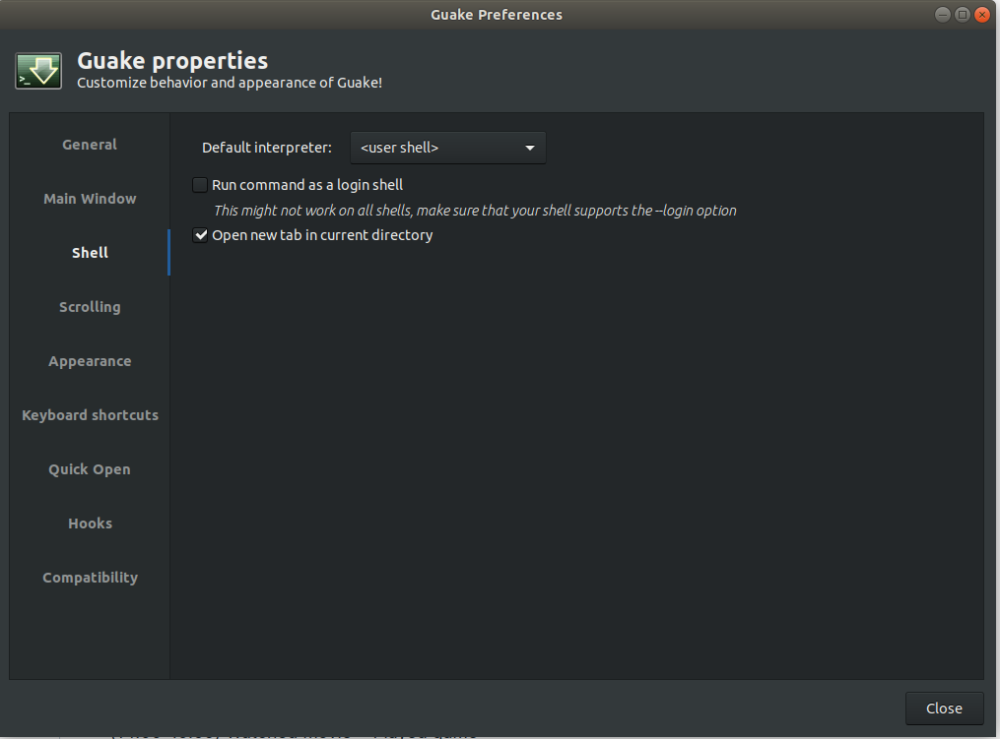
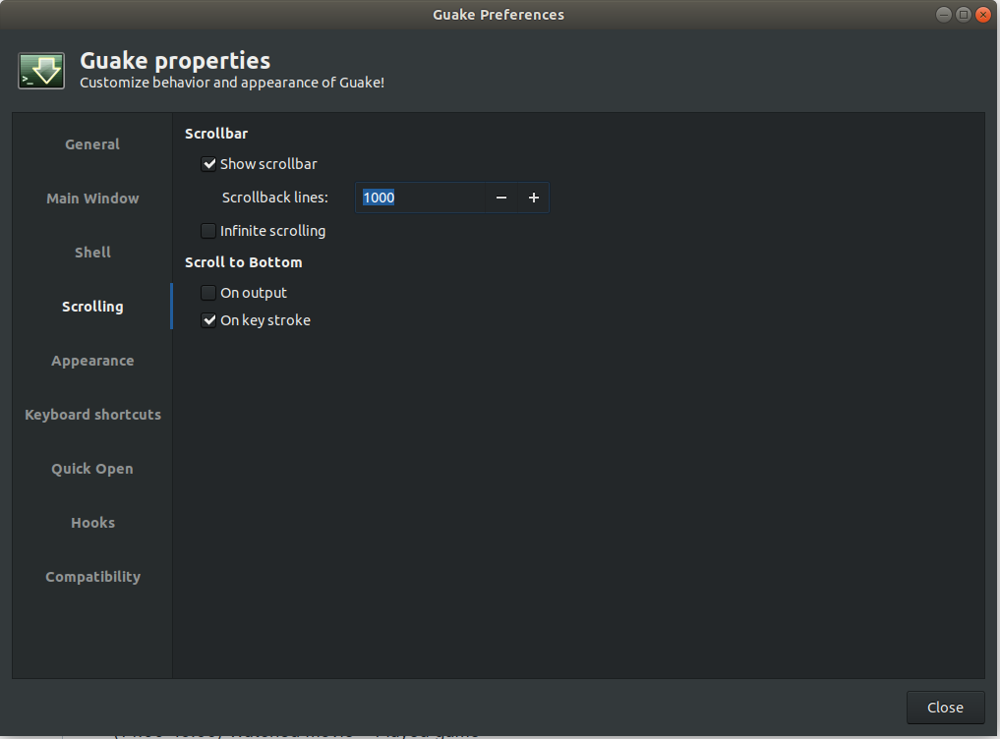
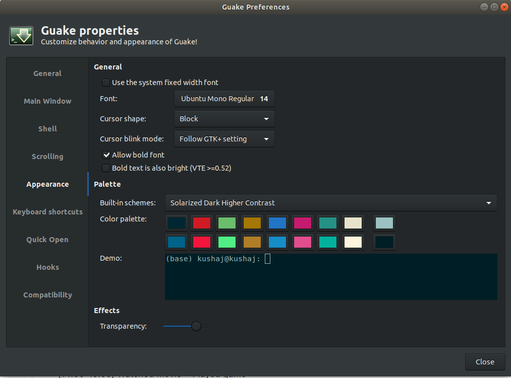
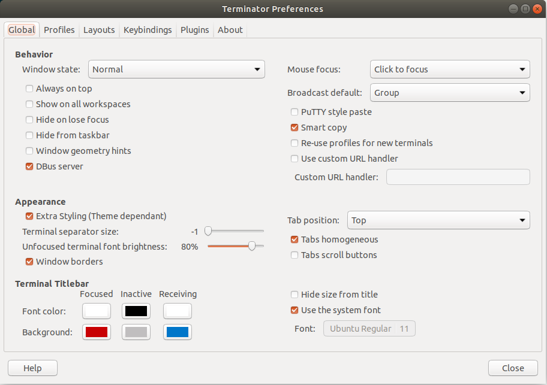
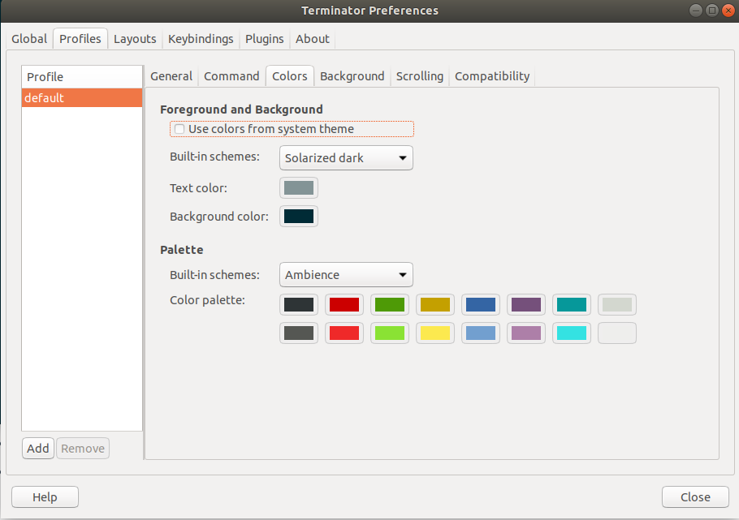
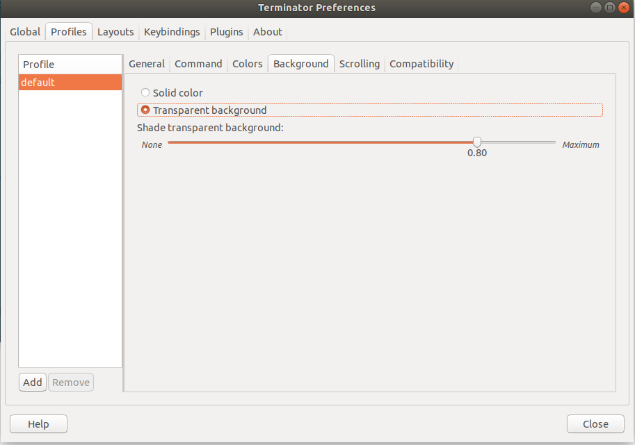
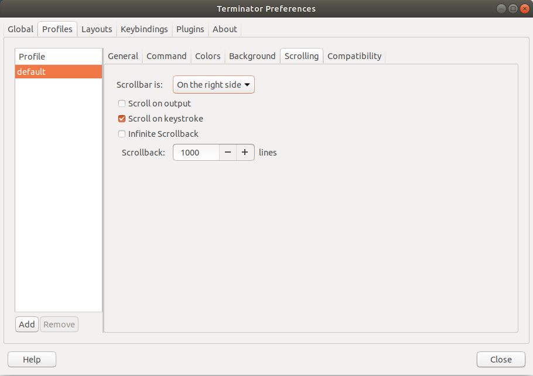

# From Drive
1. apsources-cleanup.pyz
    - Place in home directory
    - `chmod a+x aptsources-cleanup.pyz`
    - `sudo ./aptsources-cleanup.pyz`
2. Place `black.jpeg` in Documents

1. Goto *Ubuntu Software* and remove unnecessary packages.
2. Goto *Software & Updates* and do following changes
    - Ubuntu Software
        - Select all except Source code
        - Download form main server
    - Updates
        - Select all
        - Notify me of long-term support versions
        - Security updates download and install automatically
3. Customize settings
    - Dock (38 icon size, auto-hide on)
    - Power
        - Turn off dim screen when inactive
        - Blank screen (never)
        - Automatic suspend (off)
        - When power button is pressed (nothing)
    - Mouse
        - Mouse speed (in middle)
        - Natural Scrolling (Off)
        - Touchpad Natural Scrolling (on)
        - Touchpad speed (in middle)
        - Edge scrolling (off)
4. Custom things
    - `sudo apt update; sudo apt upgrade; sudo apt autoremove`
    - `sudo apt install gnome-tweak-tool`
        - Desktop (Mounted Volumes off)
        - Ubuntu Mono Regular 13
        - Keyboard & Mouse -> Additional Layout Options -> Caps Lock behavior -> Swap ESC and Caps Lock
    - `sudo apt install ubuntu-restricted-extras`
    - `sudo apt install tree`
5. Download following software
    - Download **Google chrome**
        - `wget -q -O - https://dl-ssl.google.com/linux/linux_signing_key.pub | sudo apt-key add -`
        - `sudo sh -c 'echo "deb [arch=amd64] http://dl.google.com/linux/chrome/deb/ stable main" >> /etc/apt/sources.list.d/google.list'`
        - `sudo apt update; sudo apt upgrade`
        - `sudo apt install google-chrome-stable`
        - Setup chrome
            - Use email *kushajreal@gmail.com*
            - Configure extensions
            - Add other *kushajveer@gmail.com* in gmail.
    - Install **nvidia driver**
        - `sudo add-apt-repository ppa:graphics-drivers/ppa`
        - `sudo apt update; sudo apt upgrade`
        - Look for the latest stable release [here](https://launchpad.net/~graphics-drivers/+archive/ubuntu/ppa)
        - `sudo apt install nvidia-driver-430`
    - Install **Cuda** [link](https://docs.nvidia.com/cuda/cuda-installation-guide-linux/index.html)
    - Install **terminator**
        - `sudo apt install terminator`
    - Download **xpad**
        - `sudo apt install xpad`
    - Downlaod **Guake** from source [link](https://github.com/Guake/guake), [install_instructions](https://guake.readthedocs.io/en/latest/user/installing.html#install-from-source)
        - `git clone https://github.com/Guake/guake.git`
        - `./scripts/bootstrap-dev-debian.sh run make`
        - `make`
        - `sudo make install`
    - Download **htop** for system monitoring [link](https://github.com/hishamhm/htop)
        - `git clone https://github.com/hishamhm/htop.git`
        - `./autogen.sh`
        - `./configure`
        - `make`
        - `sudo make install`
    - Download **Flameshot**
        - `sudo apt install flameshot`
    - Download VLC
        - `sudo snap install vlc`
    - Download **textlive**
        - `sudo apt install texlive-full`
        - Add to bashrc with appropriate changes
            ```
            export PATH=/usr/local/texlive/2019/bin/x86_64-linux:$PATH
            export MANPATH=/usr/local/texlive/2019/texmf-dist/doc/man:$MANPATH
            export INFOPATH=/usr/local/texlive/2019/texmf-dist/doc/info:$INFOPATH
            ```
    - Download **Texmaker**
        - Download package from [here](https://www.xm1math.net/texmaker/download.html)
        - It is deb package to double click to install.
    - Download **KLatexFormula**
        - `sudo apt intsall klatexformlua`
    - Download PDFSamBasic [link](https://pdfsam.org/download-pdfsam-basic/)
    - (Optional) **Geany** (for C++) \[[link](https://www.geany.org/)\]
6. Open system tray and organize everything into folders
7. Customize Guake
    - 
    - 
    - 
    - 
    - 
8. Customize terminator
    - 
    - 
    - 
    - 
    - 
9. Customize NVIDIA X Server Settings
10. Setup Github SSH
    1. Check for existing keys (id_rsa.pub, id_ecdsa.pub, id_ed25519.pub)
        - `ls -al ~/.ssh`
    2. Generate a new SSH key
        - `ssh-keygen -t rsa -b 4096 -C "kushajreal@gmail.com"`
        - Enter passphrase
        - `eval "$(ssh-agent -s)"`
        - `ssh-add ~/.ssh/id_rsa`
    3. Connect SSH with github
        - `sudo apt install xclip`
        - `xclip -sel clip < ~/.ssh/id_rsa.pub`
        - Goto Settings -> SSH and GPG keys -> New SSH Key (Give title Ubuntu 20.04 personal)
        - `sudo apt remove xclip`
11. Setup ~/.bashrc
    - `export PS1='\u@\h: '` (add this to root as well)
    - Setup alias
        ```
        alias update_ubuntu='sudo apt update; sudo apt upgrade; sudo apt autoremove'
        alias update_conda='conda update --all'

        alias hub='cd ~/Desktop/Github'
        alias temp='cd ~/Desktop/Temp'

        alias fastai='conda activate fastai'
        alias base='conda activate base'
        alias lab='jupyter lab'
        alias note='jupyter notebook'
        ```
12. Setup ~/.condarc
    - `channel_prioirty: false`
13. Setup folders
    - Desktop/Temp
    - Desktop/Data
    - Desktop/My Computer
    - Desktop/Github
        - KushajveerSingh.github.io (`git clone git@github.com:KushajveerSingh/Deep-Learning-Notebooks.git`)
        - Create backup for .github.io (in Portfolio folder)
        - Deep Learning Notebooks (`git clone git@github.com:KushajveerSingh/KushajveerSingh.github.io.git`)
        - Desktop/Github/dl_packages
            1. **nbdev**
                - `git clone https://github.com/fastai/nbdev.git`
                - `python3 -m pip install -e nbdev`
            2. **nbdev_template**
                - `git clone git@github.com:KushajveerSingh/nbdev_template.git`
                - Make relevant changes to `setup.py` and upload it to Github
            3. **fastcore**
                - `git clone https://github.com/fastai/fastcore`
                - `cd fastcore`
                - `python3 -m pip install -e ".[dev]"`
            4. **fastai2**
                - `git clone https://github.com/fastai/fastai2`
                - `cd fastai2`
                - `python3 -m pip install -e ".[dev]"`
    - Add these folders to the sidebar in given order
        - Data
        - Github
        - Notebooks
        - Temp
        - MyComputer
14. Jupyter notebook setup
    - `python3 -m pip install https://github.com/ipython-contrib/jupyter_contrib_nbextensions/tarball/master`
    - `jupyter contrib nbextension install --user`
    - Add extensions (Nbextensions edit menu item, spellchecker, ExecuteTime, jupyter-js-widgets, contrib_nbextensions_help_item, jupyter_server_proxy/tree, nbdime/index, scrolldown, nbextensions dashboard tab, toggle all line numbers)
15. Jupyter lab setup
    - Extensions (debugger, github, jupyterlab-manager, toc, jupyterlab_spellchecker, nbdime-jupyterlab)
    - Settings
        1. Document Manager
            ```
            {
                "autosaveInterval": 60,
            }
            ```
        2. Keyboard Shortcuts
            ```
            {
                "shortcuts": [
                    {
                        "command": "notebook:restart-and-run-to-selected",
                        "keys": [
                            "Ctrl Shift Z"
                        ],
                        "selector": ".jp-Notebook:focus"
                    },
                    {
                        "command":"notebook:restart-run-all",
                        "keys": [
                            "Ctrl Shift X"
                        ],
                        "selector": ".jp-Notebook:focus"
                    },
                ]
            }
            ```
        3. Notebook
            ```
            {
                "codeCellConfig": {
                    "lineNumbers": true,
                    "codeFolding": true,
                },
                    
                "kernelShutdown": true,
                    
                "markdownCellConfig": {
                    "autoClosingBrackets": true,
                    "lineNumbers": true,
                    "codeFolding": true,
                },
            }
            ```
16. VsCode
    - Extensions (Anaconda Extension Pack, Bracket Pair Colorizer, C/C++, Code Spell Checker, Git Graph, Github Markdown Preview, GitLens--Git supercharged, Markdown checkboxes, Markdwon PDF, Markdown Preview Github Styling, MArkdown yaml Preamble, PrintCode, Python, SonarLint, TODO Highlight, vscode-icons, YAML)
    - Files to exclude
        `**/.git, **/.svn, **/.hg, **/CVS, **/.DS_Store, **/__pycache__, **/.ipynb_checkpoints`
    - Manually go through settings

    
# fastai environment

1. Create conda environment `conda create -n fastai python=3.8 anaconda`

2. Install jupyterlab with extensions.

    ```
    conda install -c conda-forge nodejs
    python3.8 -m pip install jupyterlab==2.0.1
    conda install -c conda-forge jupyter_nbextensions_configurator
    python3.8 -m pip install jupyterlab_server==1.0.7
    

    ############### github extension ###############
    jupyter labextension install @jupyterlab/github
    
    # Goto Github account settings -> Developer Settings -> personal access tokens -> Generate new token.
    
    pip install jupyterlab_github
    jupyter notebook --generate-config
    code /home/kushaj/.jupyter/jupyter_notebook_config.py 

    # Add this line to the above file
    c.GitHubConfig.access_token = '< YOUR_ACCESS_TOKEN >'

    # Use case
    # There is plugin button in the left-sidebar from where you can enter github repo name.
    ################################################
    

    ############### nbdime extension ###############
    pip install nbdime

    # Use case
    # In top-bar there is a button called `git which you can press to view the diff in jupyter.
    ################################################


    ################ toc extension #################
    jupyter labextension install @jupyterlab/toc

    # Use case
    # There is plugin button in the left-sidebar from where you can view table of contents.
    ################################################


    ############# quickopen extension ##############
    python3.8 -m pip install jupyterlab-quickopen
    jupyter labextension install @parente/jupyterlab-quickopen

    # Use case
    # There is plugin button in the left-sidebar from where you can search for files. A keyboard shortcut can also be assigned.
    ################################################


    ############### topbar extension ###############
    python3.8 -m pip install nbresuse
    jupyter labextension install jupyterlab-topbar-extension
    jupyter labextension install jupyterlab-logout
    jupyter labextension install jupyterlab-theme-toggle
    jupyter labextension install jupyterlab-system-monitor
    ################################################


    ########## go-to-definition extension ##########
    jupyter labextension install @krassowski/jupyterlab_go_to_definition

    # Use case
    # alt-click -> mouse shortcut
    # ctrl-alt-b -> keyboard shortcut
    ################################################


    ########## language-server extension ###########
    python3.8 -m pip install jupyter-lsp
    jupyter labextension install @krassowski/jupyterlab-lsp
    python3.8 -m pip install python-language-server[all]

    # Use case
    # Hover over any piece of code, if underline appears press Ctrl to get a tooltip
    # Critical errors have red underline, warnings are orange
    # Place cursor on a variable, function, etc and all the usages will be highlighted
    # Rename variable, function and more names using F2 shortcut
    # A diagnostic panel can also be displayed by searching "Show diagnostics panel" in jupyterlab commands pallete
    ################################################


    ############### matplotlib extension ###############
    python3.8 -m pip install ipympl
    jupyter labextension install @jupyter-widgets/jupyterlab-manager jupyter-matplotlib

    # Use case
    # Add "%matplotlib widget" magic function in your notebook
    ################################################


    ######## collapsible-headings extension ########
    jupyter labextension install @aquirdturtle/collapsible_headings
    ################################################


    ############### latex extension ################
    python3.8 -m pip install jupyterlab_latex
    jupyter labextension install @jupyterlab/latex

    # Need to install texlive-full, xelatex, .bib file processor
    ################################################
    ```

3. Edit User Preferences in Jupyter lab. Goto "Settings -> Advanced Settings Editor -> Notebook -> User Preferences" and use this JSON file.

    ```json
    {
        "codeCellConfig": {
            "lineNumbers": true,
            "codeFolding": true,
        },
            
        "kernelShutdown": true,
            
        "markdownCellConfig": {
            "autoClosingBrackets": true,
            "lineNumbers": true,
            "codeFolding": true,
        }
    }
    ```

    Goto "Settings -> Advanced Settings Editor -> Document Manager -> User Preferences" and use this JSON file.

    ```json
    {
        "autosaveInterval": 60,
    }
    ```

4. Install main deep learning libraries.

    ```
    ################### pytorch ####################
    conda install pytorch torchvision cudatoolkit=10.1 -c pytorch
    ################################################


    ########### fastai related packages ############
    # fastcore
    git clone https://github.com/fastai/fastcore
    cd fastcore
    python3.8 -m pip install -e ".[dev]"

    # fastai v2
    git clone https://github.com/fastai/fastai2
    cd fastai2
    python3.8 -m pip install -e ".[dev]"

    # fastai v2 medical
    python3.8 -m pip install pyarrow==0.16.0
    python3.8 -m pip install pydicom kornia opencv-python scikit-image

    # nbdev
    git clone https://github.com/fastai/nbdev
    python3.8 -m pip install -e nbdev
    ################################################
    ```
